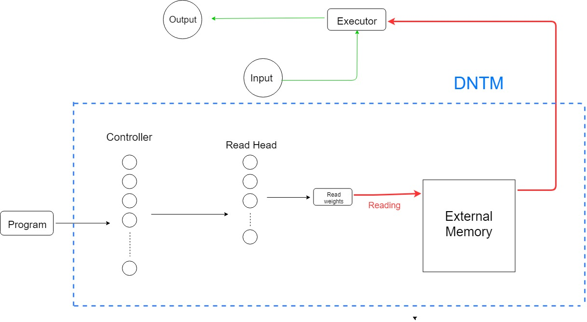
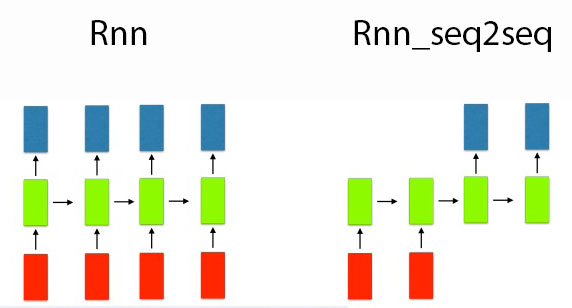
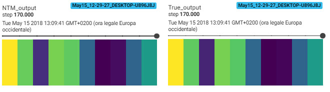
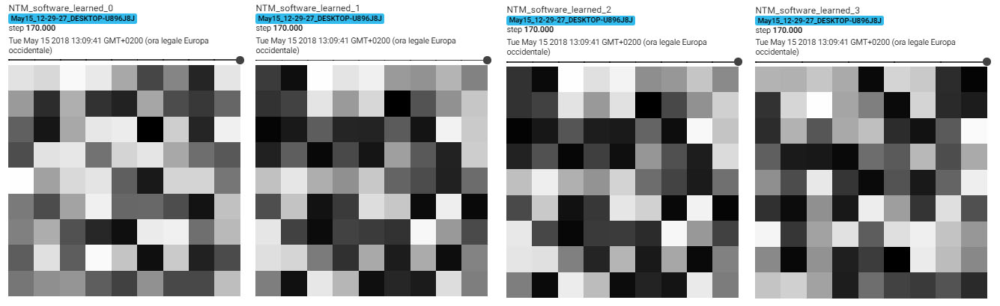
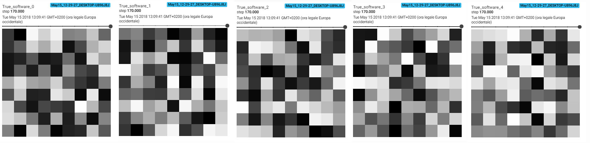
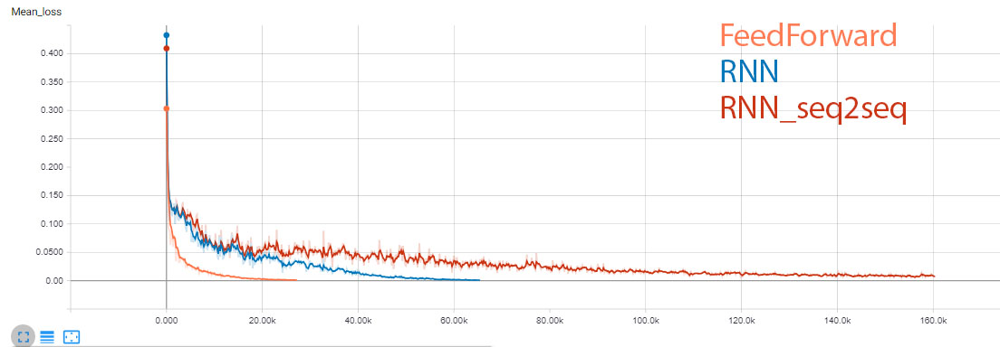

# Simple-DNTM
Not a Neural turing machine

### How to use

```
usage: train.py [-args]

```

### Model:<br>


## Controller type
--controller_type = [feedforward, rnn, rnn_seq2seq] <br><br>



## Learn functions task <br>
- Input Vector Length: 10<br> 
- Max Program length: 5<br> 
- N° Functions: 5<br> 
- Function size: 9x9<br> 


### Memory snapshot:


### Addressing locations:


### Sequence of learned functions applied by the model to generate this output: <br>


### True primitive functions (never seen by model): <br>


### Loss: <br>


### Similarity between learned functions and true functions
FeedForward Controller <br>
 [**0.98**  -0.02 0.05  0.18  -0.14]<br>
 [-0.02 **0.97**  0.08  0.03  -0.03]<br>
 [0.09  0.09  **0.92**  0.28  -0.06]<br>
 [0.17  0.06  0.3  **0.93**  0.04 ]<br>
 [-0.14 -0.03 -0.09  0.1  **0.97**]<br>

RNN Controller <br>
 [ **0.98** -0.03  0.01  0.16 -0.11]<br>
 [-0.05  **0.98**  0.05  0.02 -0.03]<br>
 [ 0.05  0.08  **0.98**  0.24 -0.05]<br>
 [ 0.21 -0.02  0.26  **0.97**  0.03]<br>
 [-0.14 -0.04 -0.11  0.09  **0.98**]<br>

RNN_seq2seq Controller <br>
 [-0.07  0.26 -0.06 -0.05 -0.05]<br>
 [ 0.02  0.1   0.05  0.08  0.07]<br>
 [-0.03 -0.11  0.07  0.23  0.19]<br>
 [ 0.03  0.14  0.12  0.24  0.21]<br>
 [ **0.93**  0.17  **0.91**  **0.79**  **0.83**]<br>
