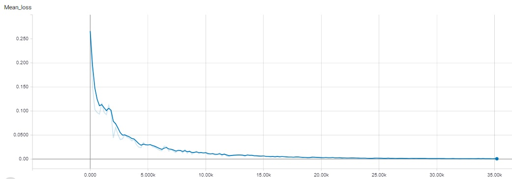
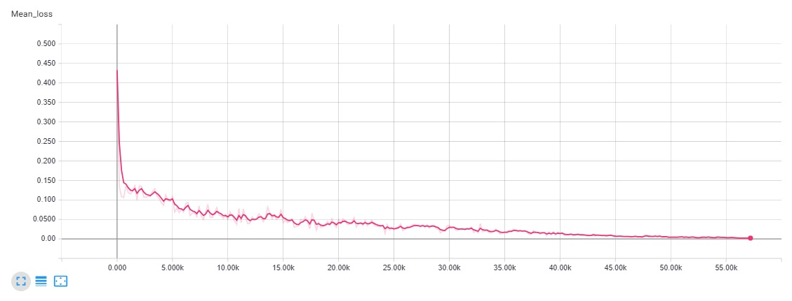

# Simple-DNTM
Not a Neural turing machine

### How to use

```
usage: train.py [-args]

```

### Model:<br>


## Controller type
--controller_type = [feedforward, rnn, rnn_seq2seq] <br><br>


## Learn functions task <br>
- Input Vector Length: 10<br> 
- Max Program length: 5<br> 
- N° Functions: 5<br> 
- Function size: 9x9<br> 


### Memory snapshot:


### Addressing locations:


### Sequence of learned functions applied by the model to generate this output: <br>


### True primitive functions (never seen by model): <br>


### Loss: <br>
FeedForward Controller <br>


Rnn Controller <br>


### Similarity between learned functions and true functions
FeedForward Controller <br>
- Similarity Function[0] = tensor([ 0.9816], device='cuda:0')
- Similarity Function[1] = tensor([ 0.9695], device='cuda:0')
- Similarity Function[2] = tensor([ 0.9227], device='cuda:0')
- Similarity Function[3] = tensor([ 0.9300], device='cuda:0')
- Similarity Function[4] = tensor([ 0.9739], device='cuda:0')

RNN Controller <br>
- Similarity Function[0] = tensor([ 0.9820], device='cuda:0')
- Similarity Function[1] = tensor([ 0.9802], device='cuda:0')
- Similarity Function[2] = tensor([ 0.9776], device='cuda:0')
- Similarity Function[3] = tensor([ 0.9707], device='cuda:0')
- Similarity Function[4] = tensor([ 0.9797], device='cuda:0')

RNN_seq2seq Controller <br>
- Similarity Function[0] = tensor([-0.0936], device='cuda:0')
- Similarity Function[1] = tensor([ 0.1777], device='cuda:0')
- Similarity Function[2] = tensor([-0.1399], device='cuda:0')
- Similarity Function[3] = tensor([ 0.1160], device='cuda:0')
- Similarity Function[4] = tensor([ 0.4007], device='cuda:0')
