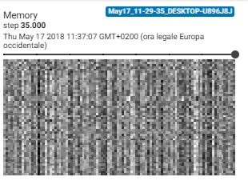

# Simple-DNTM
Not a Neural turing machine

### How to use

```
usage: train.py [-args]

```

### Model:<br>


## Controller type
--controller_type = [feedforward, rnn, rnn_seq2seq] <br><br>


## Learn functions task <br>
- Input Vector Length: 10<br> 
- Max Program length: 5<br> 
- N° Functions: 5<br> 
- Function size: 9x9<br> 


### Memory snapshot:


### Addressing locations:


### Sequence of learned functions applied by the model to generate this output: <br>


### True primitive functions (never seen by model): <br>


### Loss: <br>

